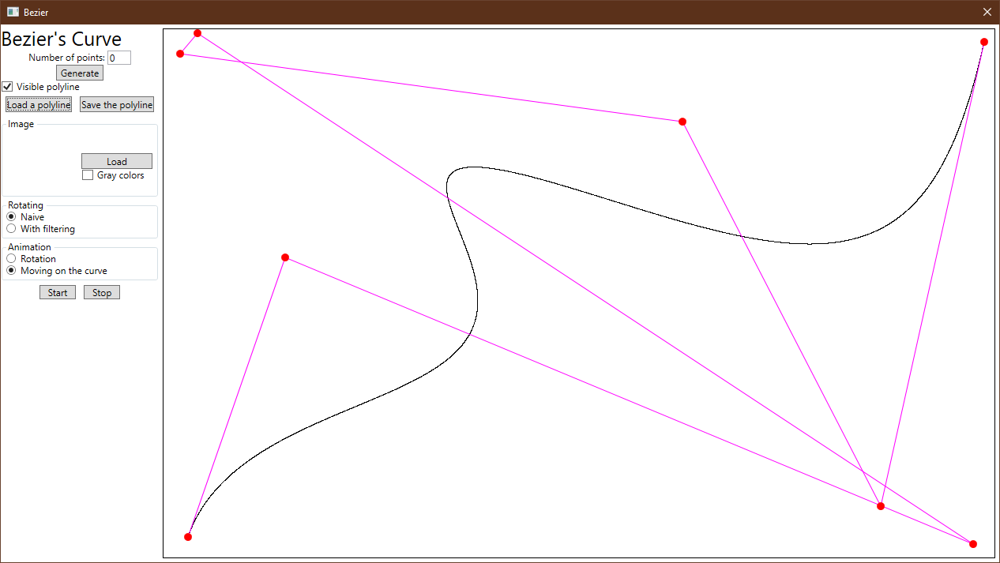
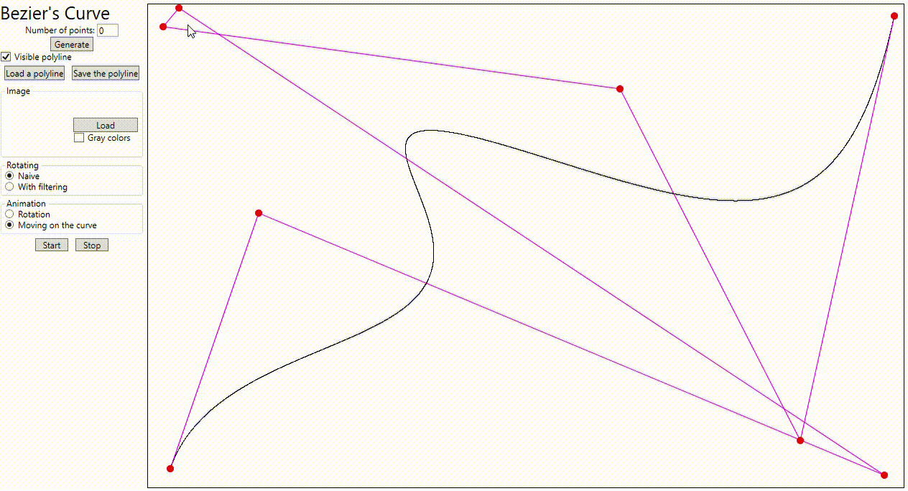

# Bezier
Autor: Sławomir Nikiel

Tematem projektu jest aplikacja z graficznym interfejsem użytkownika posiadająca następujące funkcjonalności:
* Losowe generowanie krzywych Beziera
* Zapisywanie i wczytywanie krzywych Beziera
* Manipulowanie krzywymi Beziera
* Wczytywanie obrazów z dysku
* Animacja ruchu obrazu po zadanej krzywej
* Animacja obrotów obrazu wokół środka
    * Obroty naiwne(macierz obrotów)
    * Obroty z filtrowaniem
* Wyświetlanie obrazu w kolorze lub w odcieniach szarości

## Rozwiązanie
Program zrealizowany jest w języku C#, z użyciem WPF i .NET Framework 4.7.2. Do rysowania krzywych Beziera został wykorzystany algorytm de Casteljau[[1](https://pl.wikipedia.org/wiki/Algorytm_de_Casteljau)], a zaawansowane obroty zrealizowane zostały metodą przycinania[[2](https://www.ocf.berkeley.edu/~fricke/projects/israel/paeth/rotation_by_shearing.html)] (ang. *roation by shearing*).
Interfejs aplikacji składa się z dwóch podstawowych elementów. W lewej części okna znajduje się menu pozwalające na ustawianie parametrów programu, natomiast w prawej przestrzeń na której wyświetlana jest aktualna krzywa oraz obraz.

## Sterowanie
Pole "Number of points" określa liczbę punktów łamanej definującej krzywą Beziera. Przycisk "Generate" powoduje generowanie losowej krzywej o zadanej liczbie punktów kontrolnych. Checkbox "Visible polyline" określa czy łamana jest widoczna. Przyciski "Load a polyline" i "Save the polyline" odpowiadają odpowiednio za wczytywanie i szapisywanie krzywej. Kształ krzywej Beziera może być modyfikowany poprzez przesuwanie myszą czerwonych punktów kontrolnych.

**Image**

Przycisk "Load" odpowiada za wczytywanie obrazu z dysku komputera. Obraz pojawia się na początku wyświetlanej krzywej. Natomiast checkbox "Grey colors" definuje sposób wyświetalnia obrazu.

**Rotating**

Sekcja składa się z dwóch radiobutton'ów "Naive" i "With filtering" odpowiadających odpowiednio za obroty obrazka w sposób naiwny lub z filtrowaniem. 

**Animation**

Radiobutton'y "Rotation" i "Moving on the curve" odpowiadają za wybór rodzaju animacji. Przyciski "Start" i "Stop" odpowidnio uruchamiają lub zatrzymują animację.

